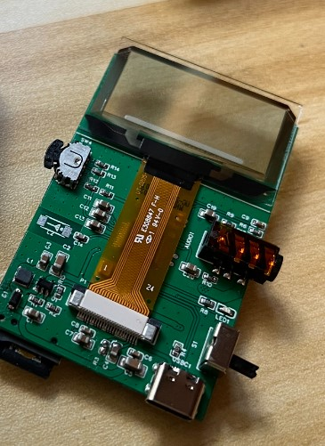

# 44Player

Transparent OLED music player, built with JieLi's AC6921A SoC.

[Hardware](Hardware)

[Firmware](Firmware)

[3D-Printed Case](3DPrint)

# Features

1. 3.5mm headphone jack.
2. Transparent OLED display.
3. Support various audio formats, including FLAC.
4. Support .lrc lyric files.
5. USB Disk/Sound Card mode.

# Notes

本项目仅包含二进制固件，不包含第三方的源码、工具，请自行联系芯片代理商获取SDK和烧录工具。

本项目仅供学习、研究，禁止用于商业用途，作者不对任何人使用本项目造成的任何后果负责。

This project only contains binary firmware and does not include third-party source code or tools. Please contact the chip agent to obtain SDK and burning tools.

This project is for learning and research only and is prohibited for commercial use. The author is not responsible for any consequences caused by anyone using this project.

